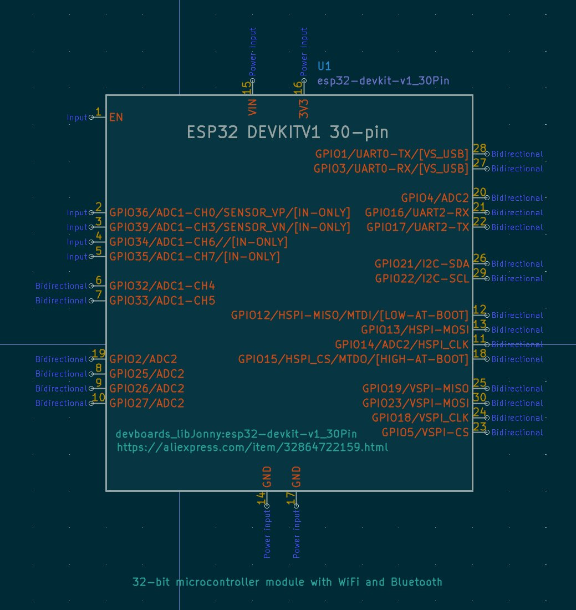

# jonny's Custom KiCad Libraries
This repository contains my custom KiCad footprints and symbols.  
They were created during various projects for very specific needs or mostly for components not available in the official library.  
  
The repository serves as a centralized, version-controlled library, enabling reuse across multiple projects and devices.  


---


## Components Overview

Below is an overview of the components included in this library.  
_Note: This list may not always be up-to-date or complete._

| Category         | Component                             | Footprint Name                                  | 3D Model           | Details  |
|------------------|---------------------------------------|-------------------------------------------------|--------------------|-----------|
| **Relays**       | -                                     | -                                               | -  | -  |
|                  |                                       |                                                 |    |    |
| **Devboards**    | ESP32-DevKitV1 (30-pin)               | esp32-devkit-v1_30Pin                           |  | Custom symbol includes useful pin descriptions   |
|                  |                                       |                                                 |    |    |
| **Terminals**    | Screw Terminal 5mm Pitch (2-pin)      | ScrewTerminal_P5mm_2Pin_FP10x8                  |  | Footprint and 3d-model optimized for stacking terminals (Silk layer aligns and includes the actual key)|
|                  | Screw Terminal 5mm Pitch (3-pin)      | ScrewTerminal_P5mm_3Pin_FP15x8                  | ✅ | see above ^ |
|                  | Screw Terminal 2.5mm Pitch (WIP)      | -                                               | -  | Work in progress.  |
|                  |                                       |                                                 |    |   |
| **ICs**          | -                                     | -                                               | -  | - |
|                  |                                       |                                                 |    |   |
| **Misc**         | Fuseholder Automotive Fuse "Regular"  | Fuseholder_Automotive-Regular_Fuse19x5x18mm     | -  |   |
|                  | Fuseholder Automotive Fuse "Mini"     | Fuseholder_Automotive-Mini_Fuse11x4x16          |  |   |
|                  |                                       |                                                 |    |   |
| **Resistors**    | Cement 5W Power Resistor              | Cement-Power-R_L22_W10_P23_Horizontal           | -  | Minimal pitch footprint for horizontal placement.   |
|                  |                                       |                                                 |    |   |
| **Mounting Holes** | Custom mounting hole with NPTH      | MountingHole_2.2mm_NPTH-with-pad_DRC-clearance-error |    | NPTH with pads on both sides; good for mounting holes on GND planes, prevents having any clearance around the hole _(useful for fixation screws at PCB-milling)_ |
|                  | Custom mounting hole with NPTH        | MountingHole_2.2mm_NPTH-with-pad_DRC-shorts-nets|   |  see above ^     |


---
<br>


## Installation

1. Clone the repository to your local machine:
   ```bash
   git clone https://github.com/Jonny999999/jonny-kicad-libs.git ~/git/kicad-library-jonny
   ```

2. Open KiCad (project manager) and add the library paths:
   - **Footprints:** Go to `Preferences > Manage Footprint Libraries > Global Libraries tab` and click `Add existing (Folder icon)`. Navigate to the cloned repository's `footprints/` directory and select all `.pretty` folders (Ctrl+Click)  
   - **Symbols:** Go to `Preferences > Manage Symbol Libraries > Global Libraries tab` and click `Add existing (Folder icon)`. Navigate to the `symbols/` directory and add the desired `.lib` files.

3. Save changes.


_Footprints installed_


---
<br>


## Usage

- Symbols are accessible as usual in the schematic-editor in the "Add Symbols" tool menu.
- Footprints can be assigned in the "Footprint Assignment Tool."
- **Note:** Most footprints currently lack custom symbols. Use generic symbols (e.g., Fuse or Screw Terminal) from the KiCad library in schematic-editor and manually map them in the assignment tool (`Tools` -> `Assign Footprints`),
- **Library Identification:** All custom libraries have `_libJonny` appended to explicitly distinguish them from standard libraries.


---
<br>


## Folder Structure
- [footprints/](footprints/): Contains all custom footprints organized by category.
- [symbols/](symbols/): Contains all custom symbols organized by category  
  __(Note: multiple symbols in one .kicad_sym file).__
- [3d-models/](3d-models/): Contains all custom 3d-models in `.step` plus original `.FCStd` format  
  (same folder structure and naming as in `footprints/` folder).

```bash
kicad-library-jonny
├── 3d-models
│   ├── devboards
│   │   └── esp32-devkit-v1_30Pin.step
│   ├── misc
│   │   ├── Fuseholder_Automotive-Mini_Fuse11x4x16_Footprint15x5_Inline.FCStd
│   │   └── Fuseholder_Automotive-Mini_Fuse11x4x16_Footprint15x5_Inline.step
│   └── terminals
│       ├── ScrewTerminal_P5mm_2Pin_FP10x8.step
│       └── ScrewTerminal_P5mm_3Pin_FP15x8.step
├── footprints
│   ├── devboards_libJonny.pretty
│   │   └── esp32-devkit-v1_30Pin.kicad_mod
│   ├── misc_libJonny.pretty
│   │   ├── Fuseholder_Automotive-Mini_Fuse11x4x16_Footprint15x5_Inline.kicad_mod
│   │   └── Fuseholder_Automotive-Regular_Fuse19x5x18_Footprint21x8mm_Inline.kicad_mod
│   ├── resistors_libJonny.pretty
│   │   └── Cement-Power-R_L22_W10_P23_Horizontal.kicad_mod
│   └── terminals_libJonny.pretty
│       ├── ScrewTerminal_P5mm_2Pin_FP10x8.kicad_mod
│       └── ScrewTerminal_P5mm_3Pin_FP15x8.kicad_mod
└── symbols
    └── devboards_libJonny.kicad_sym
```

---
<br>
