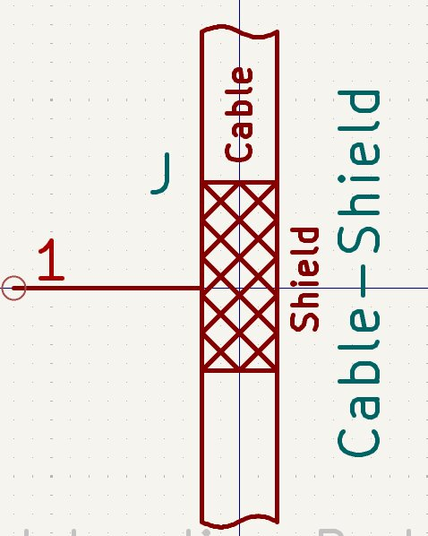

# jonny's Custom KiCad Libraries
This repository contains my custom KiCad footprints and symbols.  
They were created during various projects for very specific needs or mostly for components not available in the official library.  
  
The repository serves as a centralized, version-controlled library, enabling reuse across multiple projects and devices.  


---


## Components Overview

Below is an overview of the components included in this library.  
_Note: This list may not always be up-to-date or complete._

### Relays
| Component | Footprint Name | Symbol | Footprint | 3D Model | Details |
|-----------|----------------|--------|-----------|----------|---------|
| -         | -              | -      | -         | -        | - |


### Devboards
| Component | Footprint Name | Symbol | Footprint | 3D Model | Details |
|-----------|----------------|--------|-----------|----------|---------|
| ESP32-DevKitV1 (30-pin) | esp32-devkit-v1_30Pin |  | ✅ |  | Custom symbol includes useful pin descriptions |


### Terminals
| Component | Footprint Name | Symbol | Footprint | 3D Model | Details |
|-----------|----------------|--------|-----------|----------|---------|
| Screw Terminal 5mm Pitch (2-pin) | ScrewTerminal_P5mm_2Pin_FP10x8 | - | ✅ |  | Optimized for stacking, silk layer aligns with real part and includes the key for stacking |
| Screw Terminal 5mm Pitch (3-pin) | ScrewTerminal_P5mm_3Pin_FP15x8 | - | ✅ |  | see above ^ |
| Screw Terminal 3.5mm Pitch (2-pin) | ScrewTerminal_P3.5mm_2Pin_FP7x7 | - | ✅ |  | |
| Screw Terminal 3.5mm Pitch (3-pin) (WIP) | - | - | - | - | Work in progress |
| Hartmann Terminal 54191080051D, P2.5, 0.75mm2, 8-pole | Hartmann Terminal 54191080051D... | - | ✅ | - | |
| WAGO 231-533 Print-Pinheader, Midi, P5.08, angled 3-pole | WAGO 231-533... | - | ✅ | (✅) | |
| WAGO 713-1428 Pinheader double-deck MINI HD, P3.5, angled, 2x8-pole | WAGO 713-1428... | - | ✅ | (✅) | |
| WAGO 713-1430 Pinheader double-deck MINI HD, P3.5, angled, 2x10-pole | WAGO 713-1430... | - | ✅ | (✅) | |
| WAGO 733-363 Print-Pinheader Micro, P2.5, angled 3-pole | WAGO 733-363... | - | ✅ | (✅) | |
| WAGO 733-365 Print-Pinheader Micro, P2.5, angled, 5-pole | WAGO 733-365... | - | ✅ | (✅) | |
| WAGO 733-366 Print-Pinheader Micro, P2.5, angled, 6-pole | WAGO 733-366... | - | ✅ | (✅) | |
| WAGO 734-162 Print-Pinheader, Mini, P3.5, angled, 2-pole | WAGO 734-162... | - | ✅ | (✅) | |
| WAGO 734-163 Print-Pinheader, Mini, P3.5, angled, 3-pole | WAGO 734-163... | - | ✅ | (✅) | |
| WAGO 734-164 Print-Pinheader, Mini, P3.5, angled, 4-pole | WAGO 734-164... | - | ✅ | (✅) | |
| WAGO 734-168 Print-Pinheader, Mini, P3.5, angled, 8-pole | WAGO 734-168... | - | ✅ | (✅) | |
| WAGO 736-306 double-deck-terminal, P5, 2.50mm2, 2x6-pole | WAGO 736-306... | - | ✅ | (✅) | |
| WAGO 736-308 double-deck-terminal, P5, 2.50mm2, 2x8-pole | WAGO 736-308... | - | ✅ | (✅) | |


### ICs
| Component | Footprint Name | Symbol | Footprint | 3D Model | Details |
|-----------|----------------|--------|-----------|----------|---------|
| LTC6820_MSOP | LTC6820_MSOP |  | - | - | IC for converting a SPI interface to two-wire differential for long distance communication |
| - | - | - | - | - | - |


### Modules
| Component | Footprint Name | Symbol | Footprint | 3D Model | Details |
|-----------|----------------|--------|-----------|----------------|---------|
| AS5600 Magnetic Encoder Breakout | AS5600_Magnetic-Encoder_Breakout_Board |  |  |  | |
| SOP8 → DIP8 Adapter | Adapter-Board_SOP8_to_DIP8 | ✅ | ✅ | ✅ |  |
| ICM-426XX 6-Axis Gyro Breakout | ICM-426XX_6-Axis-Gyro_Breakout_Board | ✅ | ✅ | ✅ |  |
| TCA9548A 1-to-8 I²C Multiplexer Breakout | TCA9548A_1-to-8_I2C_Multiplexer_Breakout_Board | ✅ | ✅ | ✅ |  |


### Misc
| Component | Footprint Name | Symbol | Footprint | 3D Model | Details |
|-----------|----------------|--------|-----------|----------|---------|
| Fuseholder Automotive Fuse "Regular" | Fuseholder_Automotive-Regular_Fuse19x5x18mm | - | ✅ | - | |
| Fuseholder Automotive Fuse "Mini" | Fuseholder_Automotive-Mini_Fuse11x4x16 | - | ✅ |  | |
| Shield Landing Pad (6 mm Cable, ZipTie) | Shield_Landing_Pad_6mmCable_ZipTie |  |  | - | |


### Capacitors
| Component | Footprint Name | Symbol | Footprint | 3D Model | Details |
|-----------|----------------|--------|-----------|----------|---------|
| DualType Capacitor (Disc Ø7 mm P5mm / Elko D5 mm P2.5mm) | C_DualType__Disc-7.0x2.5mm-P5mm__Elko-D5mm-P2.5mm | - |  | - | Can populate either Elko or Foil capacitor |


### Resistors
| Component | Footprint Name | Symbol | Footprint | 3D Model | Details |
|-----------|----------------|--------|-----------|----------|---------|
| Cement 5W Power Resistor | Cement-Power-R_L22_W10_P23_Horizontal | - | ✅ | - | Minimal pitch footprint for horizontal placement |
| R_Pack04-Parallel-SIL | R_Pack04-Parallel-SIL |  | - | - | - |
| Piher trimmer | Potentiometer_Piher_PT-10-V10_Vertical | - | ✅ |  | - |


### Mounting Holes
| Component | Footprint Name | Symbol | Footprint | 3D Model | Details |
|-----------|----------------|--------|-----------|----------|---------|
| Custom mounting hole with NPTH | MountingHole_2.2mm_NPTH-with-pad_DRC-clearance-error | - | ✅ | - | NPTH with pads on both sides; good for mounting holes on GND planes, prevents having any clearance around the hole _(useful for fixation screws at PCB-milling)_ |
| Custom mounting hole with NPTH | MountingHole_2.2mm_NPTH-with-pad_DRC-shorts-nets | - | ✅ | - | Same as above, alternative DRC handling |


---
<br>


## Installation

#### 1. Clone the repository to your local machine:
```bash
# via SSH:
git clone git@github.com:Jonny999999/kicad-library-jonny.git ~/git/kicad-library-jonny
# or via HTTP:
git clone https://github.com/Jonny999999/jonny-kicad-libs.git ~/git/kicad-library-jonny
```

#### 2. [Optional] Get the Non-Public 3D Models
This project includes **3D models** collected from various sites for private use, those are stored in a separate private repository due to licensing restrictions.  
If you have access to that repo, clone it into the `3d-models/` folder:
```bash
cd 3d-models/
# via SSH:
git clone git@github.com:Jonny999999/kicad-library-jonny_nonPublicModels.git
# or via HTTP:
git clone https://github.com/Jonny999999/kicad-library-jonny_nonPublicModels.git
```
Without this step, all custom footprints in the library still work but a few corresponding 3d-models may be missing, which are nice to have, but optional for the pcb design.


#### 3. Open KiCad (project manager) and add the library paths:
- **Footprints:** 
  - Go to `Preferences > Manage Footprint Libraries > Global Libraries tab`
  - Click `Add existing (Folder icon)`. 
  - Navigate to the cloned repository's `footprints/` directory
  - Select all `.pretty` folders (Ctrl+Click to select multiple)  

- **Symbols:** 
  - Go to `Preferences > Manage Symbol Libraries > Global Libraries tab`
  - click `Add existing (Folder icon)`. 
  - Navigate to the `symbols/` directory 
  - Add the desired `.lib` files.

#### 4. Save changes by clicking `OK`


_Screenshot of Footprints installed_


---
<br>


## Usage

- Symbols are accessible as usual in the schematic-editor in the "Add Symbols" tool menu.
- Footprints can be assigned in the "Footprint Assignment Tool."
- **Note:** Most footprints currently lack custom symbols. Use generic symbols (e.g., Fuse or Screw Terminal) from the KiCad library in schematic-editor and manually map them in the assignment tool (`Tools` -> `Assign Footprints`),
- **Library Identification:** All custom libraries have `_libJonny` appended to explicitly distinguish them from standard libraries and to prevent any conflicts.


---
<br>


## Folder Structure
- [footprints/](footprints/): Contains all custom footprints organized by category.
- [symbols/](symbols/): Contains all custom symbols organized by category  
  __(Note: multiple symbols in one .kicad_sym file).__
- [3d-models/](3d-models/): Contains all custom 3d-models in `.step` plus original `.FCStd` format  
  (same folder structure and naming as in `footprints/` folder).

```bash
kicad-library-jonny
├── 3d-models
│   ├── devboards
│   │   └── esp32-devkit-v1_30Pin.step
│   ├── kicad-library-jonny_nonPublicModels
│   │   └── README.md
│   ├── misc
│   │   ├── Fuseholder_Automotive-Mini_Fuse11x4x16_Footprint15x5_Inline.FCStd
│   │   └── Fuseholder_Automotive-Mini_Fuse11x4x16_Footprint15x5_Inline.step
│   ├── modules
│   │   ├── Adapter-Board_SOP8_to_DIP8.step
│   │   ├── AS5600_Magnetic-Encoder_Breakout_Board.step
│   │   ├── ICM-426XX_gyroscope_Breakout_Board.FCStd
│   │   ├── ICM-426XX_gyroscope_Breakout_Board.step
│   │   ├── kicad_breakout-board_pcb-models
│   │   └── TCA9548A_1-to-8_I2C_Multiplexer_Breakout_Board.step
│   └── terminals
│       ├── ScrewTerminal_P3.5mm_2Pin_FP7x7.step
│       ├── ScrewTerminal_P5mm_2Pin_FP10x8.step
│       ├── ScrewTerminal_P5mm_3Pin_FP15x8.step
│       ├── screw-terminals.20250823-152655.FCBak
│       └── screw-terminals.FCStd
├── footprints
│   ├── capacitor_libJonny.pretty
│   │   └── C_DualType__Disc-7.0x2.5mm-P5mm__Elko-D5mm-P2.5mm.kicad_mod
│   ├── capacitor.pretty
│   ├── devboards_libJonny.pretty
│   │   └── esp32-devkit-v1_30Pin.kicad_mod
│   ├── ics_libJonny.pretty
│   ├── misc_libJonny.pretty
│   │   ├── Fuseholder_Automotive-Mini_Fuse11x4x16_Footprint15x5_Inline.kicad_mod
│   │   ├── Fuseholder_Automotive-Regular_Fuse19x5x18mm_Footprint21x8mm_Inline.kicad_mod
│   │   └── Shield_Landing_Pad_6mmCable_ZipTie.kicad_mod
│   ├── modules_libJonny.pretty
│   │   ├── Adapter-Board_SOP8_to_DIP8.kicad_mod
│   │   ├── AS5600_Magnetic-Encoder_Breakout_Board.kicad_mod
│   │   ├── ICM-426XX_6-Axis-Gyro_Breakout_Board.kicad_mod
│   │   └── TCA9548A_1-to-8_I2C_Multiplexer_Breakout_Board.kicad_mod
│   ├── mountingHoles_libJonny.pretty
│   │   ├── MountingHole_2.2mm_NPTH-with-pad_DRC-clearance-error.kicad_mod
│   │   └── MountingHole_2.2mm_NPTH-with-pad_DRC-shorts-nets.kicad_mod
│   ├── relays_libJonny.pretty
│   ├── resistors_libJonny.pretty
│   │   └── Cement-Power-R_L22_W10_P23_Horizontal.kicad_mod
│   └── terminals_libJonny.pretty
│       ├── Hartmann Terminal 54191080051D, P2.5, 0.75mm2, 8-pole.kicad_mod
│       ├── ScrewTerminal_P3.5mm_2Pin_FP7x7.kicad_mod
│       ├── ScrewTerminal_P5mm_2Pin_FP10x8.kicad_mod
│       ├── ScrewTerminal_P5mm_3Pin_FP15x8.kicad_mod
│       ├── WAGO 231-533 Print-Pinheader, Midi, P5.08, angled 3-pole.kicad_mod
│       ├── WAGO 713-1428 Pinheader double-deck MINI HD, P3.5, angled, 2x8-pole.kicad_mod
│       ├── WAGO 713-1430 Pinheader double-deck MINI HD, P3.5, angled, 2x10-pole.kicad_mod
│       ├── WAGO 733-363 Print-Pinheader Micro, P2.5, angled 3-pole.kicad_mod
│       ├── WAGO 733-365 Print-Pinheader Micro, P2.5, angled, 5-pole.kicad_mod
│       ├── WAGO 733-366 Print-Pinheader, Micro, P2.5, angled, 6-pole.kicad_mod
│       ├── WAGO 734-162 Print-Pinheader, Mini, P3.5, angled, 2-pole.kicad_mod
│       ├── WAGO 734-163 Print-Pinheader, Mini, P3.5, angled, 3-pole.kicad_mod
│       ├── WAGO 734-164 Print-Pinheader, Mini, P3.5, angled, 4-pole.kicad_mod
│       ├── WAGO 734-168 Print-Pinheader, Mini, P3.5, angled, 8-pole.kicad_mod
│       ├── WAGO 736-306 double-deck-terminal, P5, 2.50mm2, 2x6-pole.kicad_mod
│       └── WAGO 736-308 double-deck-terminal, P5, 2.50mm2, 2x8-pole.kicad_mod
├── LICENSE
├── README.md
└── symbols
    ├── devboards_libJonny.bak
    ├── devboards_libJonny.kicad_sym
    ├── ics_libJonny.bak
    ├── ics_libJonny.kicad_sym
    ├── misc_libJonny.bak
    ├── misc_libJonny.kicad_sym
    ├── modules_libJonny.bak
    ├── modules_libJonny.kicad_sym
    ├── resistors_libJonny.kicad_sym
    ├── switches_libJonny.bak
    └── switches_libJonny.kicad_sym
```

---
<br>
